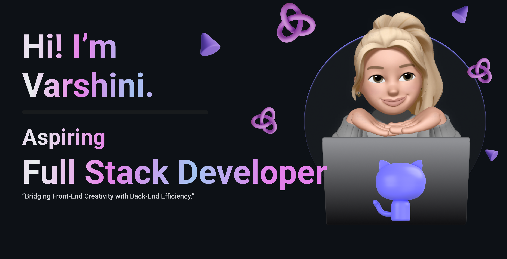

<h1 align="center">Hi 👋, I'm Varshini Vangeti</h1>
<h3 align="center">Aspiring Full Stack Developer from India.</h3>

  

  

- 📫 How to reach me **22wh1a05e6@bvrithyderabad.edu.in**

- ⚡ Fun fact **The last book I read was Just add Magic by Cindy Callaghan.**

<h3 align="left">Connect with me:</h3>

<h3 align="left">Languages and Tools:</h3>

         

&nbsp;

